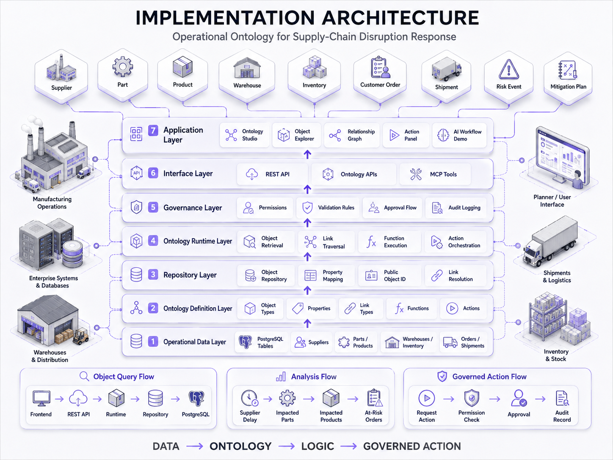
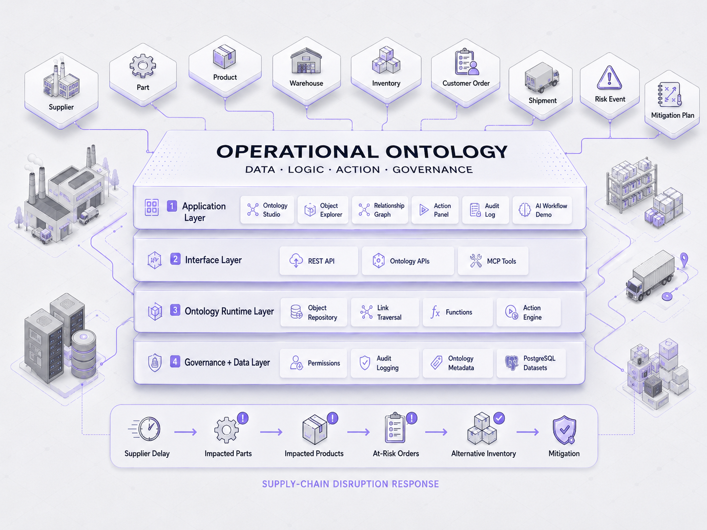

# Operational Ontology

Operational Ontology is an independent open-source reference implementation that explores ontology-driven operational systems using concepts publicly documented by Palantir Foundry.

This repository is not affiliated with, endorsed by, or integrated with Palantir. It is a smaller independent implementation built with PostgreSQL, FastAPI, React/Next.js, ontology metadata, deterministic functions, governed actions, auditability, and planned MCP-based AI access.

## Abstract

This project demonstrates how raw supply-chain records can be represented as business objects, properties, relationships, derived functions, governed actions, permissions, audit records, and eventually AI-accessible tools. Instead of leaving operational meaning scattered across isolated database tables and endpoint handlers, the repository is intended to expose a governed business model over those records.

The reference scenario is supply-chain disruption response. In that model, suppliers, parts, products, warehouses, purchase orders, customer orders, risks, and mitigation plans are treated as connected operational objects. Read-only functions derive impact and recommendations from those connections. Governed actions are the only path for important operational writes. Audit records preserve execution history and accountability.

## Reference Model

This repository is informed by publicly available Palantir Foundry documentation describing ontology-centered operational modeling. The project uses those materials as a conceptual reference, then implements its own smaller open-source architecture and workflow.

Key references:

- Ontology overview: <https://www.palantir.com/docs/foundry/ontology/overview/>
- Ontology core concepts: <https://www.palantir.com/docs/foundry/ontology/core-concepts/>
- Why create an Ontology: <https://www.palantir.com/docs/foundry/ontology/why-ontology/>
- Ontology system architecture: <https://www.palantir.com/docs/foundry/architecture-center/ontology-system/>
- Action Types overview: <https://www.palantir.com/docs/foundry/action-types/overview/>
- Ontology SDK overview: <https://www.palantir.com/docs/foundry/ontology-sdk/overview/>
- Ontology MCP overview: <https://www.palantir.com/docs/foundry/ontology-mcp/overview/>
- Foundry datasets: <https://www.palantir.com/docs/foundry/data-integration/datasets/>

In this repository, those reference concepts are interpreted as follows:

- Supply-chain datasets are expected to live in PostgreSQL tables.
- Ontology metadata describes object types, properties, links, functions, actions, roles, and permissions.
- Backend runtimes and handlers are responsible for deterministic function execution, governed writes, authorization, idempotency, and auditing.
- The frontend is intended to expose both ontology metadata and operational object workflows without reducing the system to generic CRUD.
- MCP-based AI access is planned to use the same ontology runtime and permission boundaries rather than a separate AI-only access path.

## What The System Demonstrates

A standard CRUD application typically exposes operational entities separately through endpoints such as orders, suppliers, inventory positions, or purchase orders. In that model, business meaning often remains implicit in route handlers, queries, and UI logic.

This project is intended to add a distinct business layer:

- A supplier becomes an ontology object rather than only a database row.
- Parts and products are connected through defined relationship metadata.
- Functions derive operational information such as impact, availability, and ranking.
- Actions express governed business operations rather than generic updates.
- Permissions describe who may inspect or execute which capabilities.
- Audit records capture material state changes and action execution history.
- AI clients are planned to use approved ontology tools rather than direct database access.

The result is a system where operational data is modeled as a governed network of business objects and behaviors, not only as tables plus endpoints.

## Supply-Chain Reference Scenario

The reference use case is supply-chain disruption response, especially supplier delay analysis and mitigation.

```text
Supplier delay
  -> Impacted parts
  -> Impacted products
  -> At-risk customer orders
  -> Available warehouse inventory
  -> Alternative purchase orders
  -> Ranked operational impact
  -> Mitigation recommendation
  -> Governed action
  -> Audit record
```



The context documents define a deterministic supplier-delay scenario in which a delayed supplier causes downstream part, product, and order impact. The repository is meant to demonstrate this workflow through ontology metadata, backend runtimes, read-only analysis functions, governed actions, and later AI-assisted access. The full scenario is not yet implemented end to end.

## Concept Mapping

| Palantir-documented concept | Operational Ontology interpretation |
| --- | --- |
| Dataset | PostgreSQL supply-chain tables and related operational records |
| Object Type | Ontology metadata describing entities such as Supplier, Part, Product, Warehouse, RiskEvent, and MitigationPlan |
| Object | A business entity resolved from stored operational data |
| Property | A mapped stored field or derived field on an object |
| Link Type | A defined relationship between business objects |
| Function | Read-only derived operational logic executed through backend handlers |
| Action Type | A validated and governed business operation executed through the action runtime |
| Permissions | Role-based access rules over objects, functions, actions, and audit visibility |
| Auditability | Action execution history and before/after operational change records |
| Ontology MCP | Planned MCP tools backed by ontology objects, functions, and approved draft actions |

## Implementation Architecture

> The detailed implementation architecture is being designed and will be added here. It will describe the responsibilities and data flow across the dataset, ontology metadata, repository, runtime, function, action, permission, audit, API, frontend, and AI/MCP layers.

<!-- TODO: Add the written implementation architecture after the architecture design is finalized. -->

## Architecture Diagram

> A visual architecture diagram for this reference implementation is being designed and will be added here.



<!-- TODO: Add the finalized Operational Ontology architecture diagram. -->

## Operational Workflow

One representative workflow for the intended system is:

1. A supplier delay is identified as a `RiskEvent`.
2. The system finds supplied parts affected by the delay.
3. The system finds products that depend on those parts.
4. The system finds impacted customer orders.
5. The system calculates stockout risk and inventory availability.
6. The system evaluates alternative warehouses and expeditable purchase orders.
7. The system ranks impacted orders.
8. The system recommends a mitigation approach.
9. A draft mitigation plan is created and later submitted, approved, and executed through governed actions.
10. Action execution history and audit records capture the resulting decisions and changes.

From the current repository context:

- Implemented now: only the project skeleton, health integration, and local development structure.
- Designed in context documents: ontology object model, runtime boundaries, read-only function set, governed action set, permission model, audit model, operational frontend structure, and MCP-based AI workflow.
- Planned later: full supplier-delay workflow execution, approval flow, action execution history, complete object exploration, and MCP-backed assistant behavior.

## Current Implementation Status

### Implemented

- FastAPI backend startup and `GET /health`
- Environment-based backend configuration and CORS setup
- Next.js application shell with placeholder routes
- Centralized frontend API client and backend health query
- Docker Compose wiring for `postgres`, `backend`, and `frontend`
- Repository scripts, Makefile commands, and baseline project structure

### In Progress

- Defining the ontology metadata, runtime contracts, and object model
- Designing the backend runtime split across objects, links, functions, actions, permissions, and audit
- Designing the operational frontend for ontology exploration, object inspection, function execution, and governed actions
- Designing MCP-based AI access that uses the same ontology runtime and authorization boundaries

### Planned

- PostgreSQL-backed supply-chain object model and deterministic seed scenario
- Ontology metadata loader, validator, and immutable registry
- Read-only ontology functions for impact, inventory, ranking, recommendation, and validation
- Governed action execution with authorization, idempotency, transactions, and audit history
- Risk-event and mitigation-plan workflow pages
- Action execution and audit-log user interfaces
- MCP server and in-application assistant with `AIAgent` restrictions

The repository should not currently be treated as production-ready, feature-complete, or as a finished implementation of the full documented architecture.

## Repository Structure And Technology

Primary technologies currently selected in the repository and context documents:

- Backend: Python, FastAPI, Pydantic, SQLAlchemy, Alembic, PostgreSQL
- Frontend: Next.js App Router, React, TypeScript, Tailwind CSS
- Testing and tooling: pytest, Vitest, React Testing Library, Playwright, Docker Compose
- Ontology layer: YAML metadata, backend loader/validator/registry, runtime-dispatched functions and actions
- AI integration direction: MCP tools and an `AIAgent`-restricted assistant using the same ontology runtime

Important top-level directories:

```text
backend/         FastAPI application and planned ontology runtime
frontend/        Next.js application
docs/            Implementation context documents and design boundaries
infrastructure/  Environment and deployment support files
scripts/         Local setup and helper scripts
tests/           End-to-end and other test scaffolding
```

## Running The Project

The current README setup information is preserved below because it matches the implemented repository skeleton.

### Prerequisites

- Python 3.12+
- Node.js 20+
- npm
- Docker and Docker Compose

### Environment setup

1. Copy `.env.example` to `.env` and adjust values as needed.
2. Copy `backend/.env.example` to `backend/.env` if you want backend-local overrides.
3. Copy `frontend/.env.example` to `frontend/.env.local` if you want frontend-local overrides.

### Local startup without Docker

1. Run `./scripts/setup.sh` or `./scripts/setup.ps1`.
2. Start the backend:

```bash
cd backend
python -m uvicorn app.main:app --reload --host 0.0.0.0 --port 8000
```

3. Start the frontend in a second shell:

```bash
cd frontend
npm run dev
```

Available endpoints in the current skeleton:

- Frontend: `http://localhost:3000`
- Backend: `http://localhost:8000`
- Health: `http://localhost:8000/health`
- Docs: `http://localhost:8000/docs`

### Docker startup

```bash
docker compose up --build
```

After startup:

- Frontend: `http://localhost:3000`
- Backend: `http://localhost:8000`
- Health: `http://localhost:8000/health`
- Docs: `http://localhost:8000/docs`

Migrations and seed data are intentionally not run automatically in Docker because those phases are not yet implemented.

## Limitations

- This repository is a learning and reference implementation, not a full production platform.
- It reproduces selected architecture and governance ideas inspired by publicly documented Foundry ontology concepts, not the full Foundry platform.
- It is not affiliated with or endorsed by Palantir.
- Some architecture, frontend, governance, action, and AI/MCP capabilities are still under development.

## Official References

- Ontology overview: <https://www.palantir.com/docs/foundry/ontology/overview/>
- Ontology core concepts: <https://www.palantir.com/docs/foundry/ontology/core-concepts/>
- Why create an Ontology: <https://www.palantir.com/docs/foundry/ontology/why-ontology/>
- Ontology system architecture: <https://www.palantir.com/docs/foundry/architecture-center/ontology-system/>
- Action Types overview: <https://www.palantir.com/docs/foundry/action-types/overview/>
- Ontology SDK overview: <https://www.palantir.com/docs/foundry/ontology-sdk/overview/>
- Ontology MCP overview: <https://www.palantir.com/docs/foundry/ontology-mcp/overview/>
- Foundry datasets: <https://www.palantir.com/docs/foundry/data-integration/datasets/>
